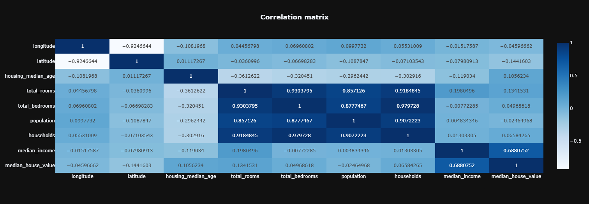
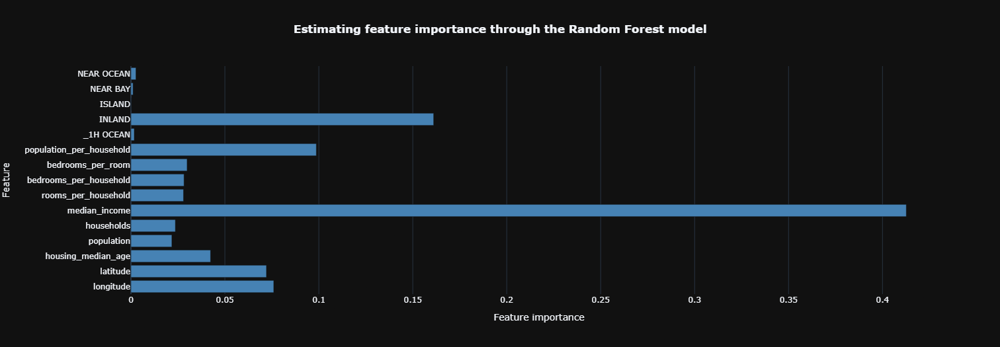
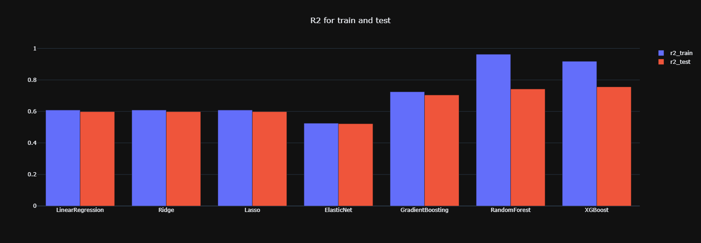
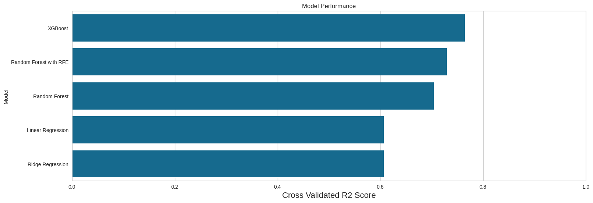

<div align="center">

# 🏡 California Housing Price Prediction


*A full machine learning pipeline — from EDA and feature engineering to multi-model comparison and hyperparameter tuning — for predicting median house values across California districts.*

</div>

---

## 📌 Project Overview

Analyzed the **California Housing Prices dataset** (20,640 records, 10 features) sourced from the 1990 U.S. Census to build a regression model predicting median house values across California districts. The project supports **investment decisions in the California real estate market** through data-driven insights.

**Research Questions:**
- Which features have the strongest correlation with median house value in California?
- Does proximity to the ocean significantly influence housing prices?
- Does population density affect housing prices?
- Which regression model best predicts California housing prices?
- How does hyperparameter tuning improve model performance?

---

## 🛠️ Tools Used

| Tool | Purpose |
|---|---|
| Python | Core programming language |
| Pandas, NumPy | Data manipulation and feature engineering |
| Matplotlib, Seaborn, Plotly | Data visualization |
| Missingno | Missing value visualization |
| Scikit-learn | ML models, RFE, preprocessing, evaluation |
| XGBoost | Gradient boosting regression |
| PyCaret | AutoML comparison and LightGBM tuning |

---

## 📁 Repository Structure

```
california-housing-price-prediction/
│
├── 📓 notebook/
│   └── housing_prediction.ipynb          # Full ML pipeline notebook
│
├── 📊 data/
│   └── housing.csv                        # California Housing dataset (Kaggle)
│
├── 📈 results/
│   ├── correlation_matrix.png             # Feature correlation heatmap
│   ├── feature_importance_rf.png          # Random Forest feature importance
│   ├── r2_train_test.png                  # R² score train vs test per model
│   └── cross_validated_r2.png            # Cross-validated R² per model
│
└── README.md
```

---

## 🔧 Data Preparation

1. **Loaded** 20,640 records × 10 columns — geographic, demographic, and housing features from Kaggle
2. **Outlier removal** — IQR-based on numerical features to reduce the effect of extreme values
3. **Missing value handling** — KNN Imputation (k=2), more robust than simple mean/median imputation
4. **Feature engineering** — derived 4 new ratio features:

| New Feature | Formula |
|---|---|
| `rooms_per_household` | total_rooms ÷ households |
| `bedrooms_per_household` | total_bedrooms ÷ households |
| `bedrooms_per_room` | total_bedrooms ÷ total_rooms |
| `population_per_household` | population ÷ households |

5. **Encoding** — One-Hot Encoding for `ocean_proximity` categorical feature
6. **Scaling** — StandardScaler applied for linear models
7. **Split** — 70% training / 30% testing

---

## 🤖 Modelling

Trained and compared **6 regression models:**

| Model | Type |
|---|---|
| Linear Regression | Baseline linear model |
| Ridge Regression | L2-regularized linear model |
| Lasso | L1-regularized linear model |
| ElasticNet | L1+L2 combined regularization |
| Random Forest | Ensemble tree-based model |
| XGBoost | Gradient boosting model |

**Additional techniques:**
- 🔍 **Recursive Feature Elimination (RFE)** with Random Forest for feature selection
- ⚙️ **GridSearchCV** for Ridge Regression hyperparameter tuning
- 🤖 **PyCaret AutoML** for LightGBM tuning across 10-fold cross-validation

---

## 📸 Results & Visualizations

### 🔗 Correlation Matrix


### 🌲 Feature Importance — Random Forest


### 📊 R² Score — Train vs Test per Model


### 📊 Cross-Validated R² Score per Model


---

## 💡 Key Insights

| Finding | Detail |
|---|---|
| 💰 Top Predictor | **Median income** — highest feature importance across all models |
| 🌊 Ocean Proximity | **ISLAND** and **NEAR BAY** districts command highest median values |
| 👥 Population Density | Weaker-than-expected correlation with house prices |
| 🏆 Best Manual Model | **XGBoost** — R² = **0.7633** after hyperparameter tuning |
| 🤖 Best AutoML Model | **LightGBM** (via PyCaret) — top performer in 10-fold CV |

---

## ✅ Recommendations

- 🥇 **XGBoost or LightGBM** is recommended as the production model due to consistently high R² scores and robustness to outliers
- 🔮 **Future work:** Incorporate geospatial clustering or time-series price trend data per district to improve prediction accuracy

---

## 🚀 How to Run

```bash
git clone https://github.com/rafihanif30/california-housing-price-prediction.git
cd california-housing-price-prediction
pip install pandas numpy matplotlib seaborn plotly scikit-learn xgboost pycaret missingno

jupyter notebook notebook/housing_prediction.ipynb
```

> 📥 Dataset: [California Housing Prices — Kaggle](https://www.kaggle.com/datasets/camnugent/california-housing-prices)

---

<div align="center">

## 👤 Author

**Rafi Hanifa Fikri**
📧 rafihanifafikri30@gmail.com
🎓 Information Systems — Gunadarma University

---

*If you found this helpful, please consider giving a ⭐ to this repository!*

</div>
